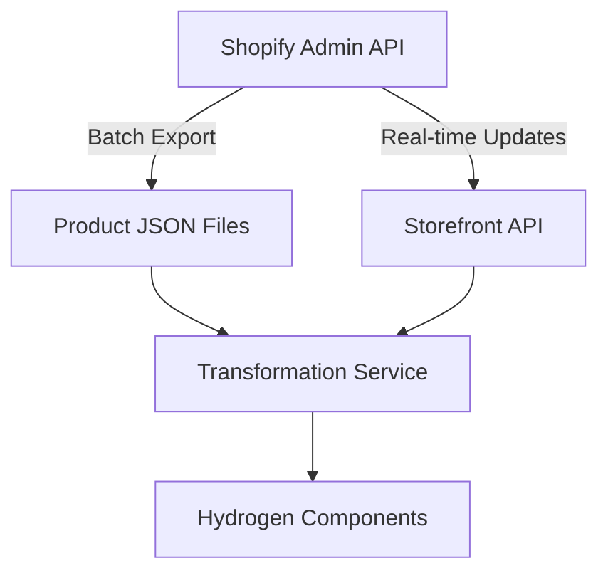

# Head Artworks Product Migration Strategy (Phase 7.2)

## Overview
This document outlines the strategy for migrating product data from Shopify to Hydrogen components while maintaining data integrity and performance.

## Data Flow Architecture

## Migration Approach

### 1. Initial Batch Migration
- Export all products via Shopify Admin API
- Process in chunks of 100 products
- Store intermediate JSON files
- Transform using `product-transforms.ts`
- Validate before Hydrogen integration

### 2. Real-time Updates
- Subscribe to product changes via webhooks
- Use Storefront API for incremental updates
- Implement retry logic for failed updates
- Throttle API calls to stay within rate limits

## Transformation Requirements

| Shopify Field | Hydrogen Component | Transformation Notes |
|--------------|--------------------|----------------------|
| product.images | ProductImage | CDN optimization, format conversion |
| variants | ProductForm | Option value mapping |
| priceRange | ProductPrice | Currency formatting |
| metafields | ProductItem | Craftsmanship extraction |

## Error Handling
- Log all transformation failures
- Implement dead-letter queue for failed items
- Manual review process for critical failures

## Performance Considerations
- Batch size: 100 products
- Parallel processing: 5 concurrent batches
- Estimated migration time: 2 hours for 10,000 products

## Rollback Plan
1. Maintain pre-migration snapshots
2. Implement feature flagging
3. Prepare rollback scripts

## Next Steps
- [ ] Implement batch processor
- [ ] Set up webhook subscriptions
- [ ] Configure monitoring