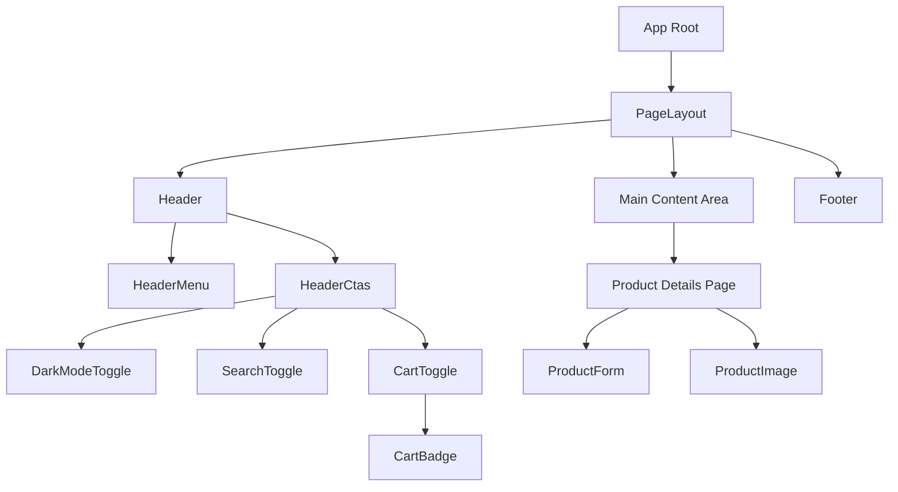
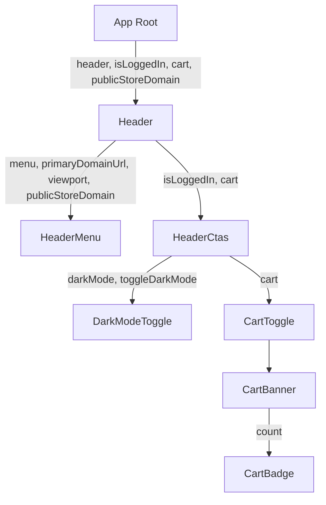

### Detailed UI Analysis Plan

This plan outlines the steps to perform a comprehensive UI analysis of the codebase, focusing on the code structure's support for UI implementation, component organization, potential for reusability, styling approaches, and adherence to UI principles.

**Phase 1: Component Organization and Structure**

1.  **Examine Component Directory Structure:**
    *   Review the `app/components/` directory and its subdirectories (`cart/`, `layout/`, `product/`, `search/`).
    *   Assess if the current categorization is logical, promotes discoverability, and aids in maintaining a clear separation of concerns.
    *   Identify any components that seem misplaced or could benefit from further grouping.

2.  **Analyze Individual Component Files:**
    *   For a sample of components (e.g., `Header.jsx`, `DarkModeToggle.jsx`, `CartMain.jsx`), examine their structure:
        *   How are props defined and used?
        *   Is local state (`useState`, `useEffect`) managed effectively for UI updates?
        *   Are there clear boundaries between parent and child components?

**Mermaid Diagram: Component Hierarchy (Example)**

This diagram illustrates a simplified hierarchy of some key UI components, showing how they might be nested or interact.



**Phase 2: Reusability of Components**

1.  **Identify Reusable Patterns:**
    *   Look for common UI patterns or elements that appear across multiple components (e.g., buttons, input fields, navigation items).
    *   Evaluate if these patterns are encapsulated into highly reusable components or if there's duplication.

2.  **Assess Component Generalization:**
    *   Determine if components are sufficiently generalized to be used in various contexts without excessive prop drilling or specific-case logic.
    *   For example, is a `Button` component generic enough, or does it contain logic tied to a specific feature?

**Mermaid Diagram: Data Flow (Example: Header and Related Components)**

This diagram shows how data (props) might flow between components, indicating potential for reusability based on prop dependency.



**Phase 3: Styling Approaches**

1.  **Analyze `app/styles/app.css`:**
    *   Review the use of CSS variables (`:root`).
    *   Examine the `@import` statements to understand the global CSS architecture.
    *   Observe how component-specific styles are organized within this file or imported from others.

2.  **Evaluate `app/styles/dark-mode.css`:**
    *   Understand how dark mode is implemented (e.g., `body.dark-mode` class, specific overrides).
    *   Assess the maintainability and scalability of this approach for future theme expansions.

3.  **Overall Styling Consistency:**
    *   Determine if there's a consistent naming convention for CSS classes.
    *   Look for evidence of component-scoped styles vs. global styles.
    *   Identify any redundant or conflicting styles.

**Mermaid Diagram: Styling Architecture**

This diagram illustrates how different CSS files are integrated and applied within the application.

```mermaid
graph TD
    A[app.css] --> B[hero.css];
    A --> C[product-animations.css];
    A --> D[media-components.css];
    A --> E[blog-media.css];
    A --> F[header-transitions.css];
    A --> G[dark-mode.css];
    A --> H[infinite-scroll-gallery.css];
    A --> I[Base/Utility Styles];
    A --> J[Component-Specific Styles (e.g., .header, .cart-main)];
```

**Phase 4: Adherence to UI Principles (as reflected in code structure)**

1.  **Responsiveness:**
    *   Scan CSS files for media queries (e.g., `@media (min-width: 45em)`).
    *   Note how layout and element sizing adapt to different screen sizes.

2.  **Accessibility (A11y):**
    *   Look for `aria-*` attributes (e.g., `aria-label` in `DarkModeToggle.jsx`).
    *   Check for semantic HTML elements where appropriate.
    *   Consider keyboard navigation aspects if visible in component code (e.g., tabIndex, focus management).

3.  **Animation Performance:**
    *   Examine CSS `transition` and `animation` properties in relevant style files (e.g., `app.css`, `dark-mode.css`, `header-transitions.css`, `product-animations.css`).
    *   Note if animations use properties that trigger reflows/repaints (e.g., `width`, `height`, `left`, `top`) versus more performant properties (e.g., `transform`, `opacity`).

4.  **State Management (related to UI):**
    *   Review `useState` and `useEffect` hooks in components like `Header.jsx` for UI state management.
    *   Analyze the use of custom hooks (e.g., `useVideoContext`, `useAside`, `useOptimisticCart`) and how they abstract UI-related logic and state.
    *   Assess if UI state is co-located with the components that use it or if there's a centralized pattern.

**Phase 5: Overall Observations and Recommendations**

1.  **Synthesize Findings:** Combine observations from all phases into a cohesive summary.
2.  **Formulate Recommendations:** Provide actionable recommendations based on the analysis, covering:
    *   Improvements to component organization.
    *   Strategies for enhancing component reusability.
    *   Suggestions for optimizing styling and theme management.
    *   Areas for strengthening adherence to UI principles (responsiveness, accessibility, performance, state management).